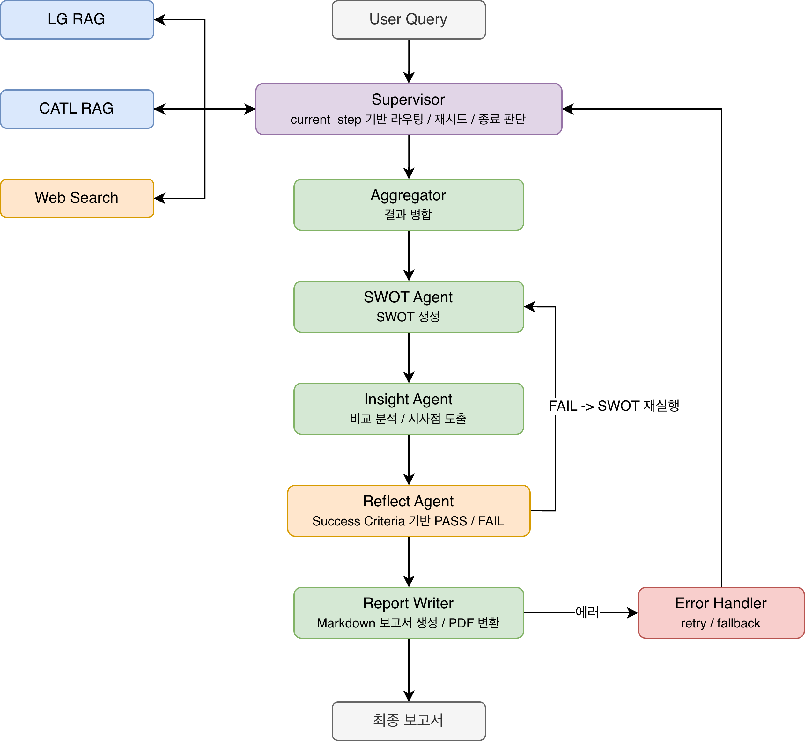

# 배터리 시장 전략 분석 Agent

> LG에너지솔루션 vs CATL 포트폴리오 다각화 전략 비교 분석 보고서 자동 생성 시스템

## Overview

- **Objective**: 전기차 캐즘 국면에서 LG에너지솔루션·CATL의 전략을 조사·분석해 배터리 업계 의사결정자가 활용할 수 있는 비교 분석 보고서 자동 생성
- **Method**: Supervisor Pattern 기반 Multi-Agent + Agentic RAG + 확증 편향 방지 웹서치
- **Tools**: LangGraph, LangChain, FAISS, multilingual-e5-large, Tavily

## Features

- PDF 문서 기반 RAG (LG / CATL 벡터스토어 물리적 분리 — Context Bleed 방지)
- 확증 편향 방지: 긍정·비판 이중 쿼리 + 출처 다양성 필터 + Devil's Advocate 프롬프트 + Reflect Balance Audit
- Agentic RAG: Query Transformation → Grade Documents → Hallucination Check 순환
- Reflect Agent: Success Criteria 기반 PASS/FAIL 자동 품질 검토
- 에러 핸들링: 에러 유형 분류(timeout / empty_retrieval / parsing_error) → retry(max 2) → fallback

## Tech Stack

| Category  | Details                               |
|-----------|---------------------------------------|
| Framework | LangGraph, LangChain, Python          |
| LLM       | GPT-4o-mini via OpenAI API            |
| Retrieval | FAISS (IndexFlatIP)                   |
| Embedding | intfloat/multilingual-e5-large (오픈소스) |
| Web Search| Tavily (fallback: DuckDuckGo)         |
| Output    | Markdown + PDF (reportlab)            |

## Agents

| Agent | 단일 책임 |
|---|---|
| Supervisor | current_step 기반 라우팅 · 재시도 · 종료 판단 |
| LG RAG Agent | data/lg/ PDF 전용 검색·분석 |
| CATL RAG Agent | data/catl/ PDF 전용 검색·분석 |
| Web Search Agent | 이중 쿼리 웹서치 + 출처 다양성 필터 |
| Aggregator | 3개 결과 병합만 담당 |
| SWOT Agent | 내부(S/W) + 외부(O/T) 4분면 생성 |
| Insight Agent | 비교 분석 · 시사점 도출 |
| Reflect Agent | Success Criteria 기반 PASS/FAIL |
| Report Writer | Markdown 보고서 생성 + PDF 변환 |
| Error Handler | retry · fallback 전환 |

## Architecture

<p align="center">
  
</p>

## Directory Structure

```
battery-agent/
├── data/
│   ├── lg/              # LG 전용 PDF
│   ├── catl/            # CATL 전용 PDF
│   └── market/          # 시장 배경 보고서
├── agents/              # 에이전트 모듈
├── retrieval/           # PDF 로더 + FAISS 임베더
├── prompts/             # 프롬프트 템플릿
├── tests/               # 단위 테스트
├── outputs/             # 생성 보고서 (MD + PDF)
├── .cache/              # FAISS 인덱스 캐시
├── state.py             # AgentState 정의
├── graph.py             # LangGraph 워크플로우
├── app.py               # CLI 실행 진입점
├── requirements.txt
└── .env.example
```

## 실행 방법

```bash
# 1. 환경 설정
pip install -r requirements.txt
cp .env.example .env    # OPENAI_API_KEY 입력

# 2. 실행
python app.py
python app.py --query "LG에너지솔루션과 CATL의 ESS 전략 비교"
python app.py --rebuild-index   # 인덱스 재구축
```

## Contributors

- 임세하: Agent Design, Prompt Engineering, RAG Pipeline, Graph 설계
